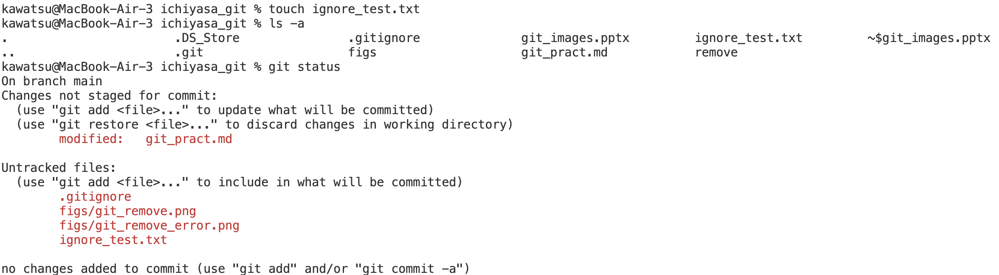
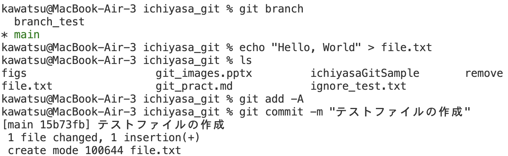
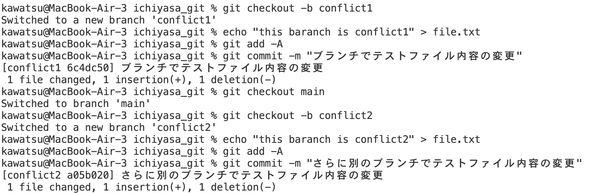

# Git練習用MD
## １番やさしいGit&GitHubの教科書使用

## ローカル環境でのgit
### gitの構成
ローカルのgitは作業を行うワークツリー、変更などを保存するローカルリポジトリ、ローカルリポジトリとワークツリーを繋ぐステージングエリアで構成される  

### gitの初期設定
- 1.ディレクトリを作成
- 2.`git init`でローカルリポジトリを作成  
最初の状態は以下の通り(現在の状態はgit statusで確認可能)  

### gitへファイルやディレクトリの追加
- 1.`git add`でステージングエリアにファイルを追加  
追加されたファイルが緑で、未追加が赤で表示されている  
  
git add ディレクトリ名でディレクトリ以下のファイルを全て指定可能  
  

  

### ファイル差分の確認
`git diff`コマンドでワークツリー-ステージングエリア間の差分を、--cachedオプションをつけることでステージングエリア-ローカルリポジトリ間の差分を確認することができる  
  

  

  

### ローカルリポジトリへの追加(commmit)
`git commit`でステージングエリアにあるファイルをローカルリポジトリに追加  
コマンドを実行するとコミットメッセージを書くためのエディタが開くのでコミットの内容を記述する  
  

  

-mオプションをつけると1行でコミットメッセージまで完了できる  
  

コミット後の状態  
  

  

### 変更の取り消し
`git checkout`や`git reset`を使うことで変更前の状態に戻すことができる  

`git checkout -- ファイル名`でワークツリーの変更を取り消す
- git checkout前  
  
- git checkout後  
  

`git reset HEAD ファイル名`でステージングエリアを最新コミットの状態にする(ワーキングエリアの状態はそのまま、ステージングが取り消されるイメージ)  
  
- git reset実行前のファイル(最新のコミット状態)  
  
- 変更したファイル(この状態でadd→resetをするとファイル状態はそのままにステージングエリアの状態は上の図に戻る)
  

  

### git管理のファイルの削除
`git rm`でファイル削除とステージングエリアへの登録を同時に行う  
  
なぜかgit rm -r removeでディレクトリが消えなかった(ファイル名がremove_test.txtと一部被ってたのが原因？)  
  

### gitで管理しないファイルの作成
.gitignoreファイルを作成することでgitで管理しないファイルを指定することができる  
  
.gitignoreに何も登録していない状態

.gitnoreに以下の内容を記述  
  

 
gitnore_test.txtが消えていることがわかる(gitの管理下から外れた)(pngが追加されているのはご愛嬌)  

### gitの履歴の確認
`git log`でコミット履歴を確認できる  
  
表示内容は上から順にコミットハッシュ(コミットを識別するタグのようなもの)、コミットの実行者、コミット日時、コミットメッセージ  
-pオプションでファイル差分などより詳細な内容を確認できる  

## githubとの連携
### リモートリポジトリのフォークとクローン
リモートリポジトリをフォークすることで元のリポジトリに影響を与えることなく変更することができる

`git remote`でリモートリポジトリの情報を確認することができる(-vオプションでURLを表示)  

### ブランチの作成
`git branch ブランチ名`でブランチを作成することができる  
`git branch`で今あるブランチを確認することができる(`git status`でも確認可能)  
`git checkout ブランチ名`で指定ブランチに移動する  
  

### ブランチで使うコマンド類
`git diff 比較したいブランチ名`で今あるブランチとの比較が行える  
  

`git push`でリモートリポジトリへ変更を反映させる  
`git push プッシュ先のリモートリポジトリ名 プッシュしたいブランチ名`  
※ このときリモートリポジトリの管理者がmasterブランチへマージしていいかを判断する(プルリクエストとレビュー)  

- 1.リモートリポジトリへプッシュする
  
- 2.プッシュ後はGitHub上にプルリクエストのためのボタンが表示される  
  
- 3.プルリクエストのためにコメントを書く  
  
- 4.プルリクエストが実行される  
  

### 作成したブランチ内での作業(この見出しに意味はない)
ブランチに関係するコマンドとか雑多なメモ  
- `git checkout -b ブランチ名`でブランチ作成&そのブランチにチェックアウト  
- ブランチ内でブランチを作成するとそのブランチからの派生となるので注意  
  

### ここはbranch_test2で書いてる内容です
ちなみに上の見出し部分のブランチ名はbranch_test  
あんま考えてないからこんなわかりにくい名前になるんです  
ということでここの内容をmainブランチに反映します  
  
  
note:`git add -A` (または`git add -all`)で変更を加えたファイル全てをステージングエリアに追加  
`git merge マージしたいブランチ名`でブランチの内容をマージできる(ちなみにここからのコメントはmainブランチで書いてます)  
  
`git merge main`とすると派生ブランチにメインブランチの内容を取り込める  
  
全体の作業内容はこんな感じ  
  

### ブランチの削除
ローカルリポジトリのブランチの削除方法は2通り  
- マージ済みのブランチを削除するには`git branch -d 削除したいブランチ名`  
- マージ状況に関わらずブランチを削除するには`git branch -D 削除したいブランチ名`  
  
-Dオプション使わなくても消えてますね  

### コンフリクトの解消
コンフリクト発生用のブランチを作ってメインブランチとコンフリクトさせてみる  
- 2*2=7841787859817  
メインブランチの記述内容
  
コンフリクトブランチの記述内容
  