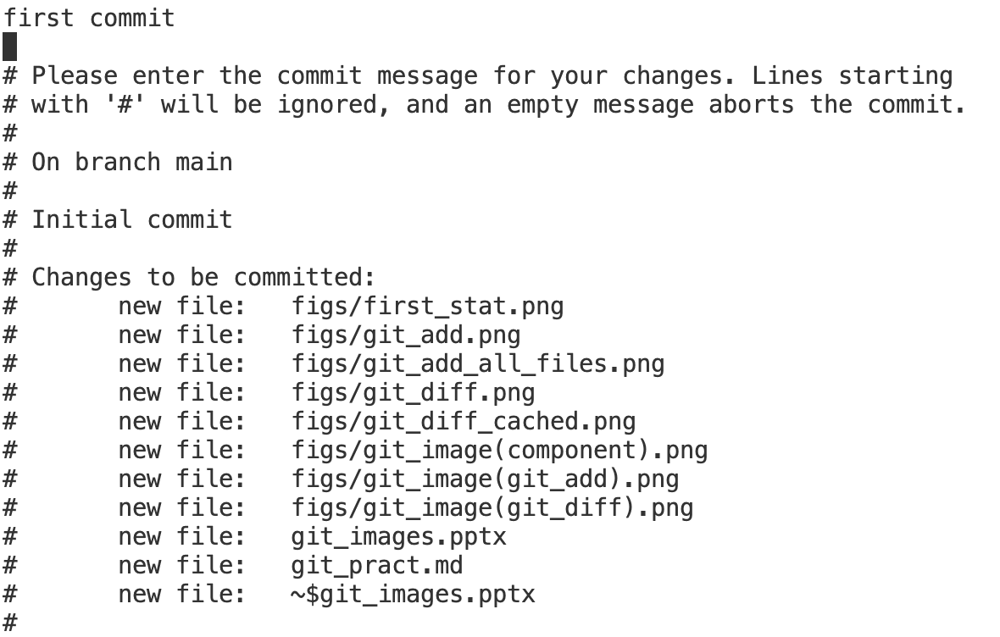

# Git練習用MD
## (１番やさしいGit&GitHubの教科書使用)

### gitの構成
ローカルなgitは作業を行うワークツリー、変更などを保存するローカルリポジトリ、ローカルリポジトリとワークツリーを繋ぐステージングエリアで構成される  

### gitの初期設定
- 1.ディレクトリを作成
- 2.git initでローカルリポジトリを作成  
最初の状態は以下の通り(現在の状態はgit statusで確認可能)  

### gitへファイルやディレクトリの追加
- 1.git addでステージングエリアにファイルを追加  
追加されたファイルが緑で、未追加が赤で表示されている  
  
git add ディレクトリ名でディレクトリ以下のファイルを全て指定可能  
  

  

### ファイル差分の確認
git diffコマンドでワークツリー-ステージングエリア間の差分を、--cachedオプションをつけることでステージングエリア-ローカルリポジトリ間の差分を確認することができる  
  

  

  

### ローカルリポジトリへの追加(commmit)
git commitでステージングエリアにあるファイルをローカルリポジトリに追加  
コマンドを実行するとコミットメッセージを書くためのエディタが開くのでコミットの内容を記述する  
  

  

-mオプションをつけると1行でコミットメッセージまで完了できる  
  

コミット後の状態  
  

  

### 変更の取り消し
git checkoutやgit resetを使うことで変更前の状態に戻すことができる  

